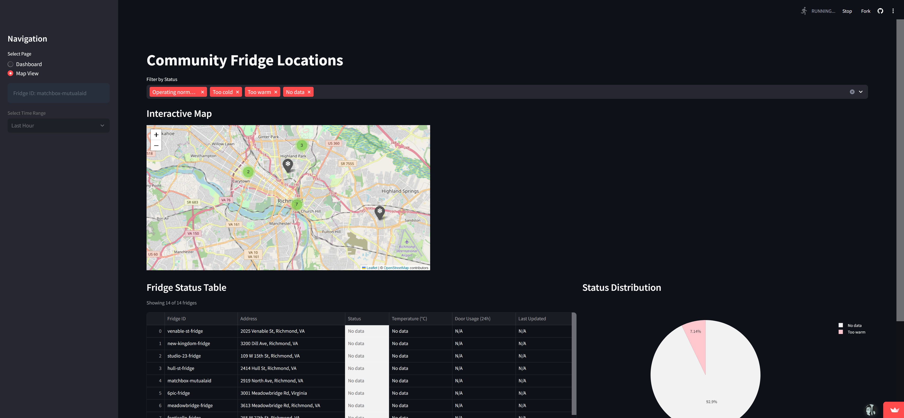
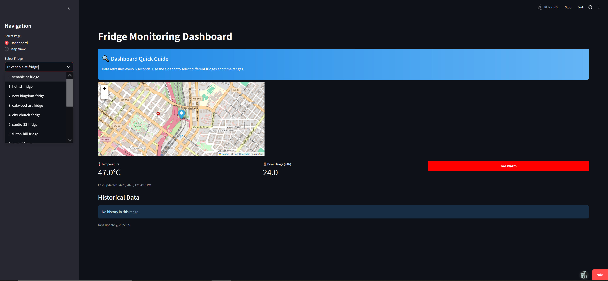

# RVA Community Fridges – Admin Dashboard

[Live Dashboard](https://rvacfdash.streamlit.app/)

## Overview
Internal admin dashboard that acts as the visibility layer for the RVA Community Fridges system. It aggregates sensor data from fridges across Richmond, VA and presents it in a clear, centralized interface used to monitor operations and support ongoing maintenance.

## What It Does
- Visualizes real-time and historical fridge telemetry
- Surfaces temperature, door activity, and device health
- Provides centralized visibility for administrators

## Tech Stack
- Frontend: Streamlit
- Backend: AWS Lambda (Python), API Gateway
- Database: Amazon Timestream
- Cloud: AWS
- Infrastructure: Docker, CloudWatch

## Data
- Temperature readings
- Door open/close events
- Device uptime and status

## Status
Active internal tool. Admin-only access.

## Notes
Before this dashboard existed, fridge status could only be checked by visiting locations in person. This tool introduced the first way for organizers and volunteers to see fridge health remotely, making it easier to stay informed, respond to issues faster, and keep fridges available to the community.

## Screenshots

